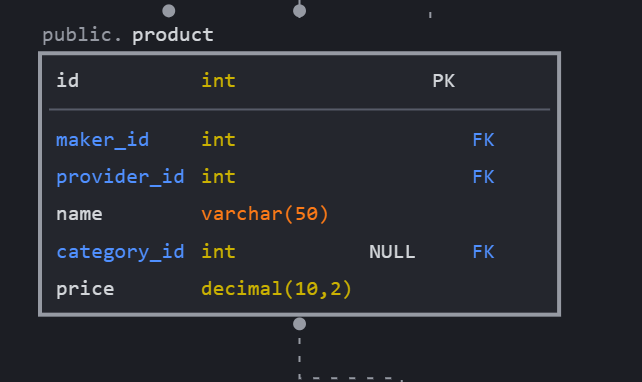

### Добавление индекса в проект
Добавил в таблицу товаров индекс по названию товара

```sql
ALTER TABLE product ADD FULLTEXT (name);
```


### Анализ скорости работы без FULLTEXT индекса и с ним
1. Добавляем тестовую талицу
```sql
CREATE TABLE note (
        id INT UNSIGNED AUTO_INCREMENT NOT NULL PRIMARY KEY,
        body TEXT
        );
```
2. Добавляем тестовые данных 10 001 записей
3. Выполняет запрос с анализом
```sql
EXPLAIN ANALYZE SELECT *
FROM note
WHERE body like "%test%";
```
4. Добавляем индекс
```sql
ALTER TABLE note ADD FULLTEXT (body);
```
5. Повторяем запрос с анализом
```sql
EXPLAIN ANALYZE SELECT *
FROM note
WHERE MATCH(body) AGAINST ('test');
```
6. Сравниваем результаты
    - Без индекса
    ```text
    -> Limit: 200 row(s)  (cost=1002.85 rows=200) (actual time=32.704..32.740 rows=1 loops=1)
        -> Filter: (note.body like '%test%')  (cost=1002.85 rows=1069) (actual time=32.640..32.675 rows=1 loops=1)
            -> Table scan on note  (cost=1002.85 rows=9626) (actual time=0.298..10.196 rows=10001 loops=1) 
    ```
    - С индексом
    ```text
    -> Limit: 200 row(s)  (cost=1.10 rows=1) (actual time=0.110..0.111 rows=1 loops=1)
    -> Filter: (match note.body against ('test'))  (cost=1.10 rows=1) (actual time=0.109..0.109 rows=1 loops=1)
        -> Full-text index search on note using body (body='test')  (cost=1.10 rows=1) (actual time=0.105..0.106 rows=1 loops=1)
    ```
7. Результат. Получает значительный прирост скорости при использовании индекса FULLTEXT
   