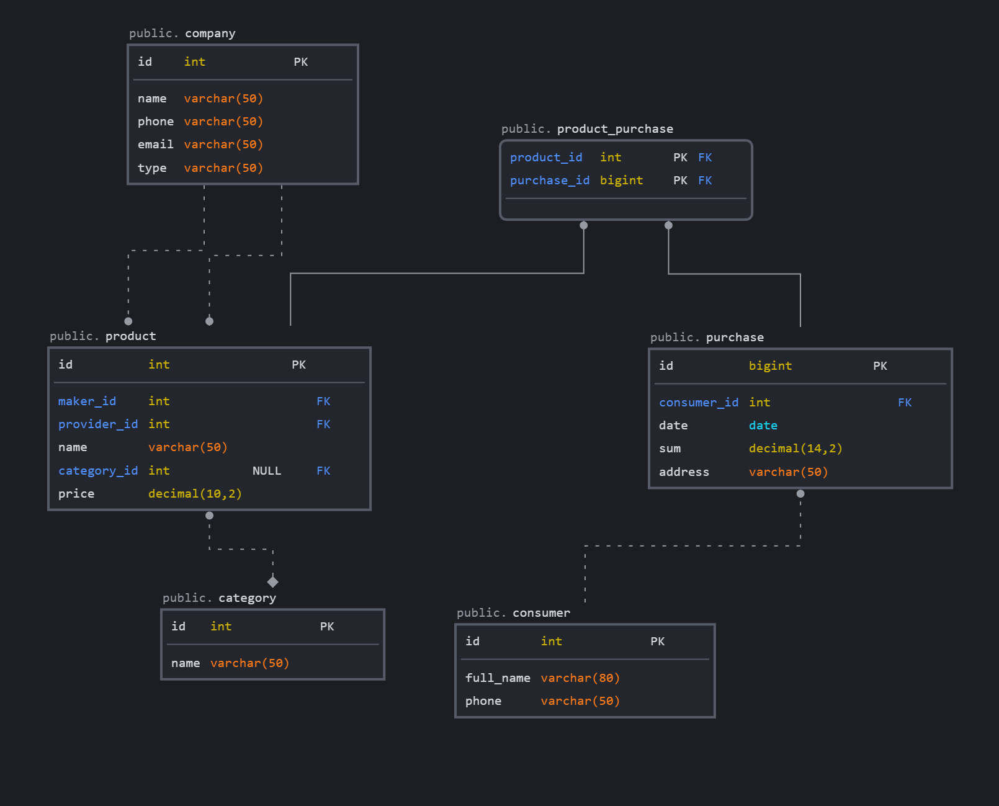

### product - `хранит информацию о продуктах`
- id - уникальный идентификатор
- name - наименование товара
- price - цена товара
- maker_id - идентификатор производителя
- provider_id - идентификатор поставщика
- category_id - идентификатор категории товара

### category - `хранит информацию о категориях`
- id - уникальный идентификатор
- name - название категории

### company - `хранит информацию о компании`
- id - уникальный идентификатор
- name - название компании
- phone - номер телефона
- mail - электронная почта компании
- type - тип компании(производитель, поставщик)

### purchase - `хранит информацию о покупках`
- id - уникальный идентификатор
- date - дата покупки
- sum - сумма покупки
- address - адресс заказа
- consumer_id - идентификатор покупателя

### consumer - `хранит информацию о поупателях`
- id - уникальный идентификатор
- full_name - полное имя покупателя
- phone - телефон